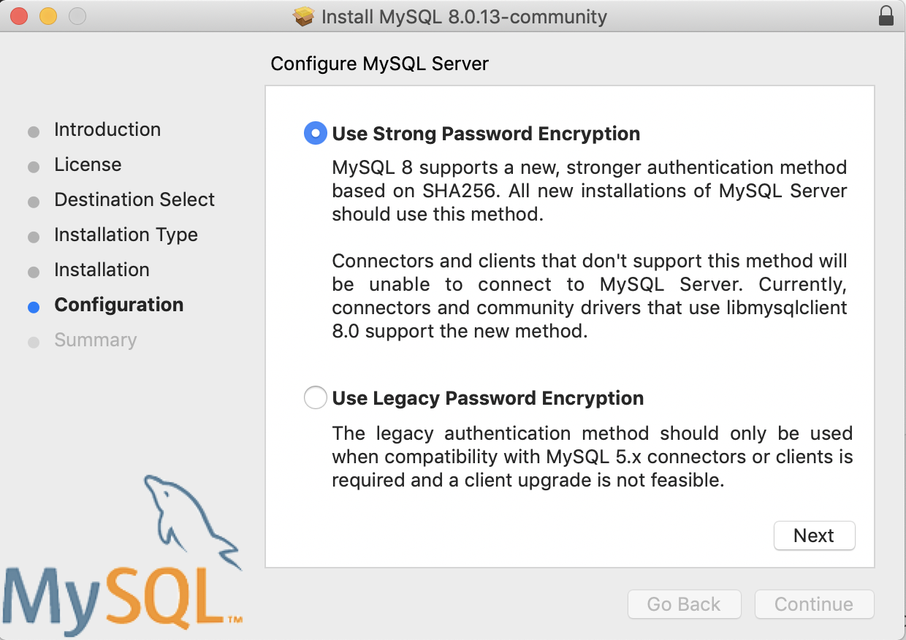
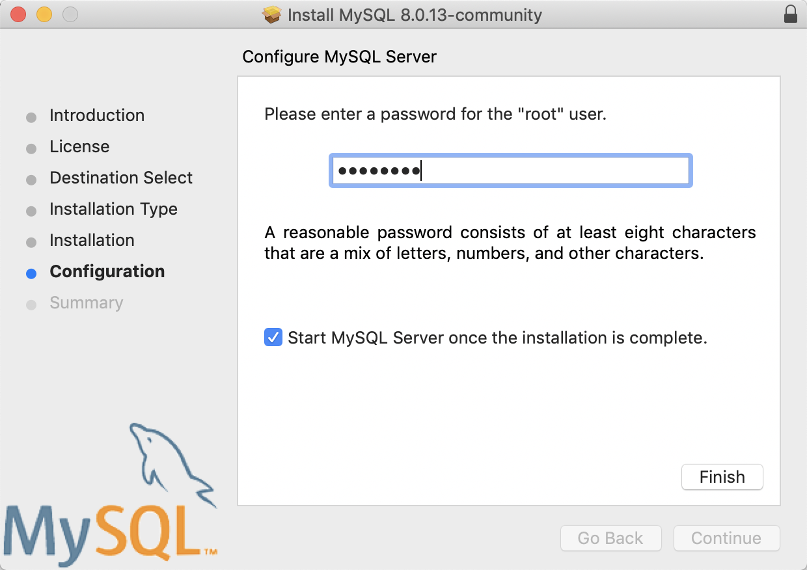
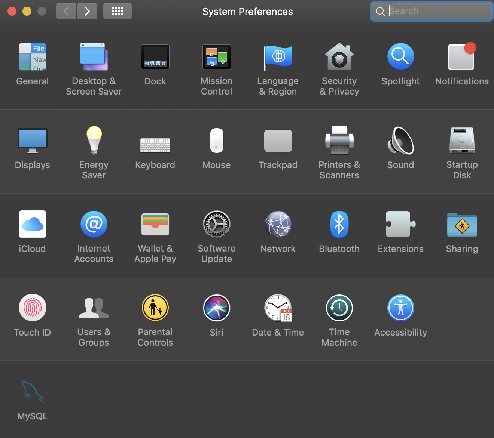

Setting up MySQL from the command line
=======

This quick tutorial covers how to set up and query a `MySQL` database from the command line (Terminal) on macOS Sierra.

## What is MySQL?

The [`SQL`](https://en.wikipedia.org/wiki/SQL) in `MySQL` stands for structured query language. There are half a dozen flavors of `SQL`, and `MySQL` is one of the most common. The `My` comes from the name of co-founder Michael Widenius's daughter (fun fact: another flavor of `SQL`, [`MariaDB`](https://en.wikipedia.org/wiki/MariaDB), is named after his younger daughter).

`MySql` is an open source relational database management system. Read more about [`MySQL`](https://en.wikipedia.org/wiki/MySQL) on Wikipedia. Or check out the reference manual [here](https://dev.mysql.com/doc/refman/5.7/en/).

## Download MySQL 

Download and install the [community edition](https://dev.mysql.com/downloads/mysql/) of `MySQL`. You will be asked to create an account, but you can opt out and just click on "*No thanks, just start my download.*"

After downloading the dmg, you will be guided through the installation steps. On the **Configuration** options, I chose **Use Strong Password Encryption** 

and on the next window I entered a password and checked the box for **Start MySQL Server once the installation is complete**

Or use `brew install mysql` if you have homebrew installed. 

After the install finishes, you should see the `MySQL` icon in the System Preferences:

## MySQL workbench (optional)

Download and install the [workbench](https://dev.mysql.com/downloads/workbench/) if you want to use an IDE for querying MySQL (I prefer [DataGrip](https://www.jetbrains.com/datagrip/)). You should read [this](https://dev.mysql.com/doc/workbench/en/) documentation on the Workbench.

## Install database drivers (using homebrew)

In a future post, I will be using RStudio to query a database using the `RMySQL` and `RMariaDB` packages. Follow these instructions [here](http://db.rstudio.com/best-practices/drivers) for installing the database drivers on your Mac.

These commands are entered into Terminal.

<pre>
# Install the unixODBC library
$ brew install unixodbc
# SQL Server ODBC Drivers (Free TDS)
$ brew install freetds --with-unixodbc
# PostgreSQL ODBC ODBC Drivers
$ brew install psqlodbc
# SQLite ODBC Drivers
$ brew install sqliteodbc
</pre>

## Installing the RMySQL package connector

I need to install the connectors for `MySQL` and `MariaDB` using `brew install mysql-connector-c` in Terminal.

<pre>
$ brew install mysql-connector-c
</pre>

After updating `Homebrew`, the connector is installed.

## Install the RMariaDB package connector

I will also install the `mariadb-connector-c` connector.

<pre>
$ brew install mariadb-connector-c
</pre>

Now we can launch `MySQL`.

## Launching up MySQL locally

The commands below are entered directly into Terminal.

1.  To find the path for the local MySQL db:

<pre>
$ export PATH=$PATH:/usr/local/mysql/bin
$ echo $PATH
</pre>

2. To start up `mysql`, enter the following:

<pre>
$ mysql -u root -p 
</pre>

3. You will be prompted for your password you used to setup MySQL--enter it into the Terminal. You should see this:

<pre>
Welcome to the MySQL monitor.  Commands end with ; or \g.
Your MySQL connection id is 12
Server version: 8.0.13 MySQL Community Server - GPL

Copyright (c) 2000, 2018, Oracle and/or its affiliates. All rights reserved.

Oracle is a registered trademark of Oracle Corporation and/or its
affiliates. Other names may be trademarks of their respective
owners.

Type 'help;' or '\h' for help. Type '\c' to clear the current input statement.

</pre>

The `MySQL` command line is below:

<pre>
mysql>
</pre>

After installing `MySQL` community edition, you can choose to either run commands from the terminal or within a .sql script in the workbench. Below I demonstrate using `MySQL` from the command line. 

## Using MySQL commands in Terminal

To see the `User` and `passwords`, enter the following commands into the Terminal. The `authentication_string` will identify the passwords (but they are encrypted).

**NOTE:** a semi-colon is needed at the end of each `MySQL` command. 

<pre>
SELECT 
  User, authentication_string 
FROM 
  mysql.user;

+------------------+------------------------------------------------------------------------+
| User             | authentication_string                                                  |
+------------------+------------------------------------------------------------------------+
| mysql.infoschema | $A$005$THISISACOMBINATIONOFINVALIDSALTANDPASSWORDTHATMUSTNEVERBRBEUSED |
| mysql.session    | $A$005$THISISACOMBINATIONOFINVALIDSALTANDPASSWORDTHATMUSTNEVERBRBEUSED |
| mysql.sys        | $A$005$THISISACOMBINATIONOFINVALIDSALTANDPASSWORDTHATMUSTNEVERBRBEUSED |
| root             | *D932DC725A9210F3B4C903D69F88EDC3AD447A06                              |
+------------------+------------------------------------------------------------------------+
4 rows in set (0.00 sec)
</pre>

The `MySQL` commands are working! Let's build a database!

## Building a MySQL database

The `lahman2016` database is freely available full of information on baseball players and teams from 1871 through 2016. You can download it [here](http://www.seanlahman.com/baseball-archive/statistics/). 

After downloading the zipped database into a local `data` folder I find the following files. 

<pre>
├── data
│   ├── lahman2016-sql
│   │   ├── lahman2016.sql
│   │   └── readme2016.txt
</pre>

The `readme2016.txt` file tells me more about the tables in the database. 

In a new Terminal window, I navigate to the `lahman2016-sql` folder and enter the following commands.

<pre>
$ cd lahman2016-sql
$ export PATH=$PATH:/usr/local/mysql/bin
$ echo $PATH
$ mysql -u root -p
</pre>

After entering my password into the Terminal, I need to run the `lahman2016.sql` file. I can do this using the `source` command in the `MySQL` prompt.

<pre>
mysql> source lahman2016.sql
</pre>

This should show a lot of activity and output, but eventually bring back the `MySQL` prompt. I can check the databases using `SHOW DATABASES;`.

<pre>
mysql> SHOW DATABASES;
+--------------------+
| Database           |
+--------------------+
| information_schema |
| lahman2016         |
| mysql              |
| performance_schema |
| sys                |
+--------------------+
5 rows in set (0.00 sec)
</pre>

## Querying a database directly from Terminal

Now that I've set up the `lahman2016` database, I can use it to demonstrate a few `MySQL` commands. I will start by selecting this database. 

<pre>
mysql> USE lahman2016;
</pre>

This prompts the following message.

<pre>
Database changed
</pre>

Now I can take a look at the tables in the `lahman2016` database.

<pre>
mysql> SHOW TABLES;
+----------------------+
| Tables_in_lahman2016 |
+----------------------+
| AllstarFull          |
| Appearances          |
| AwardsManagers       |
| AwardsPlayers        |
| AwardsShareManagers  |
| AwardsSharePlayers   |
| Batting              |
| BattingPost          |
| CollegePlaying       |
| Fielding             |
| FieldingOF           |
| FieldingOFsplit      |
| FieldingPost         |
| HallOfFame           |
| HomeGames            |
| Managers             |
| ManagersHalf         |
| Master               |
| Parks                |
| Pitching             |
| PitchingPost         |
| Salaries             |
| Schools              |
| SeriesPost           |
| Teams                |
| TeamsFranchises      |
| TeamsHalf            |
+----------------------+
27 rows in set (0.04 sec)
</pre>

## Adding a primary key to Master table

When I look at the `Master` table, I see that it was made without a primary key. 

<pre>
SHOW CREATE TABLE Master;
| Master | CREATE TABLE `Master` (
  `playerID` varchar(255) DEFAULT NULL,
  `birthYear` int(11) DEFAULT NULL,
  `birthMonth` int(11) DEFAULT NULL,
  `birthDay` int(11) DEFAULT NULL,
  `birthCountry` varchar(255) DEFAULT NULL,
  `birthState` varchar(255) DEFAULT NULL,
  `birthCity` varchar(255) DEFAULT NULL,
  `deathYear` varchar(255) DEFAULT NULL,
  `deathMonth` varchar(255) DEFAULT NULL,
  `deathDay` varchar(255) DEFAULT NULL,
  `deathCountry` varchar(255) DEFAULT NULL,
  `deathState` varchar(255) DEFAULT NULL,
  `deathCity` varchar(255) DEFAULT NULL,
  `nameFirst` varchar(255) DEFAULT NULL,
  `nameLast` varchar(255) DEFAULT NULL,
  `nameGiven` varchar(255) DEFAULT NULL,
  `weight` int(11) DEFAULT NULL,
  `height` int(11) DEFAULT NULL,
  `bats` varchar(255) DEFAULT NULL,
  `throws` varchar(255) DEFAULT NULL,
  `debut` varchar(255) DEFAULT NULL,
  `finalGame` varchar(255) DEFAULT NULL,
  `retroID` varchar(255) DEFAULT NULL,
  `bbrefID` varchar(255) DEFAULT NULL
) ENGINE=InnoDB DEFAULT CHARSET=utf8 |
</pre>

If I want to update the table so the primary key is `playerID`, I can do this with the commands below. 

<pre>
mysql> ALTER TABLE `lahman2016`.`Master` 
       CHANGE COLUMN `playerID` `playerID` varchar(255) NOT NULL ,
         ADD PRIMARY KEY (`playerID`),
         ADD UNIQUE INDEX `playerID_UNIQUE` (`playerID` ASC) VISIBLE;
</pre>

Then the `Master` table returns this when the `SHOW CREATE TABLE` command is entered into the prompt. 

<pre>
SHOW CREATE TABLE Master;
| Master | CREATE TABLE `Master` (
  `playerID` varchar(255) NOT NULL,
  `birthYear` int(11) DEFAULT NULL,
  `birthMonth` int(11) DEFAULT NULL,
  `birthDay` int(11) DEFAULT NULL,
  `birthCountry` varchar(255) DEFAULT NULL,
  `birthState` varchar(255) DEFAULT NULL,
  `birthCity` varchar(255) DEFAULT NULL,
  `deathYear` varchar(255) DEFAULT NULL,
  `deathMonth` varchar(255) DEFAULT NULL,
  `deathDay` varchar(255) DEFAULT NULL,
  `deathCountry` varchar(255) DEFAULT NULL,
  `deathState` varchar(255) DEFAULT NULL,
  `deathCity` varchar(255) DEFAULT NULL,
  `nameFirst` varchar(255) DEFAULT NULL,
  `nameLast` varchar(255) DEFAULT NULL,
  `nameGiven` varchar(255) DEFAULT NULL,
  `weight` int(11) DEFAULT NULL,
  `height` int(11) DEFAULT NULL,
  `bats` varchar(255) DEFAULT NULL,
  `throws` varchar(255) DEFAULT NULL,
  `debut` varchar(255) DEFAULT NULL,
  `finalGame` varchar(255) DEFAULT NULL,
  `retroID` varchar(255) DEFAULT NULL,
  `bbrefID` varchar(255) DEFAULT NULL,
  PRIMARY KEY (`playerID`),
  UNIQUE KEY `playerID_UNIQUE` (`playerID`)
) ENGINE=InnoDB DEFAULT CHARSET=utf8 |
</pre>

## Querying a database using .sql scripts

Another way to execute `MySQL` commands is by creating a .sql file and running these files either from the command line or using the `source` command from the `MySQL` prompt (like I did above).

This method is preferred because it is more reproducible (and it is easier to keep track of your work).

For example, if I want to collect data on Ken Griffey Junior and Senior, I can use the `MySQL` prompt to build up the query. 

1. Get the names of the columns in both tables. 

<pre>
mysql> SHOW COLUMNS FROM Batting;
+----------+--------------+------+-----+---------+-------+
| Field    | Type         | Null | Key | Default | Extra |
+----------+--------------+------+-----+---------+-------+
| playerID | varchar(255) | YES  |     | NULL    |       |
| yearID   | int(11)      | YES  |     | NULL    |       |
| stint    | int(11)      | YES  |     | NULL    |       |
| teamID   | varchar(255) | YES  |     | NULL    |       |
| lgID     | varchar(255) | YES  |     | NULL    |       |
| G        | int(11)      | YES  |     | NULL    |       |
| AB       | int(11)      | YES  |     | NULL    |       |
| R        | int(11)      | YES  |     | NULL    |       |
| H        | int(11)      | YES  |     | NULL    |       |
| 2B       | int(11)      | YES  |     | NULL    |       |
| 3B       | int(11)      | YES  |     | NULL    |       |
| HR       | int(11)      | YES  |     | NULL    |       |
| RBI      | int(11)      | YES  |     | NULL    |       |
| SB       | int(11)      | YES  |     | NULL    |       |
| CS       | int(11)      | YES  |     | NULL    |       |
| BB       | int(11)      | YES  |     | NULL    |       |
| SO       | int(11)      | YES  |     | NULL    |       |
| IBB      | varchar(255) | YES  |     | NULL    |       |
| HBP      | varchar(255) | YES  |     | NULL    |       |
| SH       | varchar(255) | YES  |     | NULL    |       |
| SF       | varchar(255) | YES  |     | NULL    |       |
| GIDP     | varchar(255) | YES  |     | NULL    |       |
+----------+--------------+------+-----+---------+-------+
22 rows in set (0.01 sec)

mysql> SHOW COLUMNS FROM Master;
+--------------+--------------+------+-----+---------+-------+
| Field        | Type         | Null | Key | Default | Extra |
+--------------+--------------+------+-----+---------+-------+
| playerID     | varchar(255) | NO   | PRI | NULL    |       |
| birthYear    | int(11)      | YES  |     | NULL    |       |
| birthMonth   | int(11)      | YES  |     | NULL    |       |
| birthDay     | int(11)      | YES  |     | NULL    |       |
| birthCountry | varchar(255) | YES  |     | NULL    |       |
| birthState   | varchar(255) | YES  |     | NULL    |       |
| birthCity    | varchar(255) | YES  |     | NULL    |       |
| deathYear    | varchar(255) | YES  |     | NULL    |       |
| deathMonth   | varchar(255) | YES  |     | NULL    |       |
| deathDay     | varchar(255) | YES  |     | NULL    |       |
| deathCountry | varchar(255) | YES  |     | NULL    |       |
| deathState   | varchar(255) | YES  |     | NULL    |       |
| deathCity    | varchar(255) | YES  |     | NULL    |       |
| nameFirst    | varchar(255) | YES  |     | NULL    |       |
| nameLast     | varchar(255) | YES  |     | NULL    |       |
| nameGiven    | varchar(255) | YES  |     | NULL    |       |
| weight       | int(11)      | YES  |     | NULL    |       |
| height       | int(11)      | YES  |     | NULL    |       |
| bats         | varchar(255) | YES  |     | NULL    |       |
| throws       | varchar(255) | YES  |     | NULL    |       |
| debut        | varchar(255) | YES  |     | NULL    |       |
| finalGame    | varchar(255) | YES  |     | NULL    |       |
| retroID      | varchar(255) | YES  |     | NULL    |       |
| bbrefID      | varchar(255) | YES  |     | NULL    |       |
+--------------+--------------+------+-----+---------+-------+
24 rows in set (0.00 sec)
</pre>

2. Decide which columns I want using a `SELECT` and `INNER JOIN` query.

<pre>
SELECT 
  -- Master columns
  mas.playerID, 
  mas.birthYear, 
  mas.nameFirst, 
  mas.nameLast, 
  mas.weight, 
  mas.height, 
  mas.bats, 
  mas.throws, 
  mas.retroID, 
  mas.bbrefID,
  -- Batting columns
  bat.teamID,
  bat.lgID,
  bat.yearID,
  bat.G,
  bat.AB,
  bat.R,
  bat.H,
  bat.HR,
  bat.RBI,
  bat.BB,
  bat.SO
FROM 
    Master AS mas
      INNER JOIN 
    Batting AS bat ON mas.playerID = bat.playerID
  WHERE nameLast = "Griffey";
</pre>

3. Write commands to create a new table (`Griffey`) to insert the Griffey data into. This is where the previous column information comes in handy. 

<pre>
CREATE TABLE Griffeys (
    playerID varchar(255) NOT NULL,
    birthYear int(11) NOT NULL,
    nameFirst VARCHAR(255) NOT NULL,
    nameLast VARCHAR(255) NOT NULL,
    weight int(11),
    height int(11),
    bats varchar(255),
    throws varchar(255),
    retroID varchar(255),
    bbrefID varchar(255),
    teamID varchar(255),   
    lgID varchar(255),
    yearID int(11),
    G int(11),
    AB int(11),
    R int(11),
    H int(11),
    HR int(11),
    RBI int(11),
    BB int(11),
    SO int(11)
);
</pre>

4. Combine the two commands into a .sql file in the `lahman2016-sql` folder: 

`data/lahman2016-sql/griffey-table.sql`

The script should contain the following:

<pre>
/*
***************************************************************************
-- This is code to create: Griffeys table
-- Authored by and feedback to mjfrigaard@gmail.com
-- MIT License
-- Version: 1.0
***************************************************************************
*/

/*
 select database
*/

USE lahman2016;

/*
 create new table
*/

CREATE TABLE Griffeys (
    playerID varchar(255) NOT NULL,
    birthYear int(11) NOT NULL,
    nameFirst VARCHAR(255) NOT NULL,
    nameLast VARCHAR(255) NOT NULL,
    weight int(11),
    height int(11),
    bats varchar(255),
    throws varchar(255),
    retroID varchar(255),
    bbrefID varchar(255),
    teamID varchar(255),   
    lgID varchar(255),
    yearID int(11),
    G int(11),
    AB int(11),
    R int(11),
    H int(11),
    HR int(11),
    RBI int(11),
    BB int(11),
    SO int(11)
);

/*
 insert the select query into the new columns
*/

INSERT INTO Griffeys (
  playerID, 
  birthYear, 
  nameFirst, 
  nameLast, 
  weight, 
  height, 
  bats, 
  throws, 
  retroID, 
  bbrefID,
  teamID,
  lgID,
  yearID,
  G,
  AB,
  R,
  H,
  HR,
  RBI,
  BB,
  SO
)
SELECT 
  -- Master columns
  mas.playerID, 
  mas.birthYear, 
  mas.nameFirst, 
  mas.nameLast, 
  mas.weight, 
  mas.height, 
  mas.bats, 
  mas.throws, 
  mas.retroID, 
  mas.bbrefID,
  -- Batting columns
  bat.teamID,
  bat.lgID,
  bat.yearID,
  bat.G,
  bat.AB,
  bat.R,
  bat.H,
  bat.HR,
  bat.RBI,
  bat.BB,
  bat.SO
  
FROM 
    Master AS mas
      INNER JOIN 
    Batting AS bat ON mas.playerID = bat.playerID
  WHERE nameLast = "Griffey";
  
-- End file
</pre>

5. Use `source` from the `MySQL` prompt to execute the file. 

<pre>
mysql> source griffey-table.sql
</pre>

Now I can check this new table using `DESCRIBE`.

<pre>
mysql> DESCRIBE Griffeys;
+-----------+--------------+------+-----+---------+-------+
| Field     | Type         | Null | Key | Default | Extra |
+-----------+--------------+------+-----+---------+-------+
| playerID  | varchar(255) | NO   |     | NULL    |       |
| birthYear | int(11)      | NO   |     | NULL    |       |
| nameFirst | varchar(255) | NO   |     | NULL    |       |
| nameLast  | varchar(255) | NO   |     | NULL    |       |
| weight    | int(11)      | YES  |     | NULL    |       |
| height    | int(11)      | YES  |     | NULL    |       |
| bats      | varchar(255) | YES  |     | NULL    |       |
| throws    | varchar(255) | YES  |     | NULL    |       |
| retroID   | varchar(255) | YES  |     | NULL    |       |
| bbrefID   | varchar(255) | YES  |     | NULL    |       |
| teamID    | varchar(255) | YES  |     | NULL    |       |
| lgID      | varchar(255) | YES  |     | NULL    |       |
| yearID    | int(11)      | YES  |     | NULL    |       |
| G         | int(11)      | YES  |     | NULL    |       |
| AB        | int(11)      | YES  |     | NULL    |       |
| R         | int(11)      | YES  |     | NULL    |       |
| H         | int(11)      | YES  |     | NULL    |       |
| HR        | int(11)      | YES  |     | NULL    |       |
| RBI       | int(11)      | YES  |     | NULL    |       |
| BB        | int(11)      | YES  |     | NULL    |       |
| SO        | int(11)      | YES  |     | NULL    |       |
+-----------+--------------+------+-----+---------+-------+
21 rows in set (0.00 sec)
</pre>

Or `SELECT *` 

<pre>
mysql> SELECT * FROM Griffeys;
+-----------+-----------+-----------+----------+--------+--------+------+--------+----------+-----------+--------+------+--------+------+------+------+------+------+------+------+------+
| playerID  | birthYear | nameFirst | nameLast | weight | height | bats | throws | retroID  | bbrefID   | teamID | lgID | yearID | G    | AB   | R    | H    | HR   | RBI  | BB   | SO   |
+-----------+-----------+-----------+----------+--------+--------+------+--------+----------+-----------+--------+------+--------+------+------+------+------+------+------+------+------+
| griffke01 |      1950 | Ken       | Griffey  |    190 |     71 | L    | L      | grifk001 | griffke01 | CIN    | NL   |   1973 |   25 |   86 |   19 |   33 |    3 |   14 |    6 |   10 |
| griffke01 |      1950 | Ken       | Griffey  |    190 |     71 | L    | L      | grifk001 | griffke01 | CIN    | NL   |   1974 |   88 |  227 |   24 |   57 |    2 |   19 |   27 |   43 |
| griffke01 |      1950 | Ken       | Griffey  |    190 |     71 | L    | L      | grifk001 | griffke01 | CIN    | NL   |   1975 |  132 |  463 |   95 |  141 |    4 |   46 |   67 |   67 |
| griffke01 |      1950 | Ken       | Griffey  |    190 |     71 | L    | L      | grifk001 | griffke01 | CIN    | NL   |   1976 |  148 |  562 |  111 |  189 |    6 |   74 |   62 |   65 |
| griffke01 |      1950 | Ken       | Griffey  |    190 |     71 | L    | L      | grifk001 | griffke01 | CIN    | NL   |   1977 |  154 |  585 |  117 |  186 |   12 |   57 |   69 |   84 |
| griffke01 |      1950 | Ken       | Griffey  |    190 |     71 | L    | L      | grifk001 | griffke01 | CIN    | NL   |   1978 |  158 |  614 |   90 |  177 |   10 |   63 |   54 |   70 |
| griffke01 |      1950 | Ken       | Griffey  |    190 |     71 | L    | L      | grifk001 | griffke01 | CIN    | NL   |   1979 |   95 |  380 |   62 |  120 |    8 |   32 |   36 |   39 |
| griffke01 |      1950 | Ken       | Griffey  |    190 |     71 | L    | L      | grifk001 | griffke01 | CIN    | NL   |   1980 |  146 |  544 |   89 |  160 |   13 |   85 |   62 |   77 |
| griffke01 |      1950 | Ken       | Griffey  |    190 |     71 | L    | L      | grifk001 | griffke01 | CIN    | NL   |   1981 |  101 |  396 |   65 |  123 |    2 |   34 |   39 |   42 |
| griffke01 |      1950 | Ken       | Griffey  |    190 |     71 | L    | L      | grifk001 | griffke01 | NYA    | AL   |   1982 |  127 |  484 |   70 |  134 |   12 |   54 |   39 |   58 |
| griffke01 |      1950 | Ken       | Griffey  |    190 |     71 | L    | L      | grifk001 | griffke01 | NYA    | AL   |   1983 |  118 |  458 |   60 |  140 |   11 |   46 |   34 |   45 |
| griffke01 |      1950 | Ken       | Griffey  |    190 |     71 | L    | L      | grifk001 | griffke01 | NYA    | AL   |   1984 |  120 |  399 |   44 |  109 |    7 |   56 |   29 |   32 |
| griffke01 |      1950 | Ken       | Griffey  |    190 |     71 | L    | L      | grifk001 | griffke01 | NYA    | AL   |   1985 |  127 |  438 |   68 |  120 |   10 |   69 |   41 |   51 |
| griffke01 |      1950 | Ken       | Griffey  |    190 |     71 | L    | L      | grifk001 | griffke01 | NYA    | AL   |   1986 |   59 |  198 |   33 |   60 |    9 |   26 |   15 |   24 |
| griffke01 |      1950 | Ken       | Griffey  |    190 |     71 | L    | L      | grifk001 | griffke01 | ATL    | NL   |   1986 |   80 |  292 |   36 |   90 |   12 |   32 |   20 |   43 |
| griffke01 |      1950 | Ken       | Griffey  |    190 |     71 | L    | L      | grifk001 | griffke01 | ATL    | NL   |   1987 |  122 |  399 |   65 |  114 |   14 |   64 |   46 |   54 |
| griffke01 |      1950 | Ken       | Griffey  |    190 |     71 | L    | L      | grifk001 | griffke01 | ATL    | NL   |   1988 |   69 |  193 |   21 |   48 |    2 |   19 |   17 |   26 |
| griffke01 |      1950 | Ken       | Griffey  |    190 |     71 | L    | L      | grifk001 | griffke01 | CIN    | NL   |   1988 |   25 |   50 |    5 |   14 |    2 |    4 |    2 |    5 |
| griffke01 |      1950 | Ken       | Griffey  |    190 |     71 | L    | L      | grifk001 | griffke01 | CIN    | NL   |   1989 |  106 |  236 |   26 |   62 |    8 |   30 |   29 |   42 |
| griffke02 |      1969 | Ken       | Griffey  |    195 |     75 | L    | L      | grifk002 | griffke02 | SEA    | AL   |   1989 |  127 |  455 |   61 |  120 |   16 |   61 |   44 |   83 |
| griffke01 |      1950 | Ken       | Griffey  |    190 |     71 | L    | L      | grifk001 | griffke01 | CIN    | NL   |   1990 |   46 |   63 |    6 |   13 |    1 |    8 |    2 |    5 |
| griffke01 |      1950 | Ken       | Griffey  |    190 |     71 | L    | L      | grifk001 | griffke01 | SEA    | AL   |   1990 |   21 |   77 |   13 |   29 |    3 |   18 |   10 |    3 |
| griffke02 |      1969 | Ken       | Griffey  |    195 |     75 | L    | L      | grifk002 | griffke02 | SEA    | AL   |   1990 |  155 |  597 |   91 |  179 |   22 |   80 |   63 |   81 |
| griffke01 |      1950 | Ken       | Griffey  |    190 |     71 | L    | L      | grifk001 | griffke01 | SEA    | AL   |   1991 |   30 |   85 |   10 |   24 |    1 |    9 |   13 |   13 |
| griffke02 |      1969 | Ken       | Griffey  |    195 |     75 | L    | L      | grifk002 | griffke02 | SEA    | AL   |   1991 |  154 |  548 |   76 |  179 |   22 |  100 |   71 |   82 |
| griffke02 |      1969 | Ken       | Griffey  |    195 |     75 | L    | L      | grifk002 | griffke02 | SEA    | AL   |   1992 |  142 |  565 |   83 |  174 |   27 |  103 |   44 |   67 |
| griffke02 |      1969 | Ken       | Griffey  |    195 |     75 | L    | L      | grifk002 | griffke02 | SEA    | AL   |   1993 |  156 |  582 |  113 |  180 |   45 |  109 |   96 |   91 |
| griffke02 |      1969 | Ken       | Griffey  |    195 |     75 | L    | L      | grifk002 | griffke02 | SEA    | AL   |   1994 |  111 |  433 |   94 |  140 |   40 |   90 |   56 |   73 |
| griffke02 |      1969 | Ken       | Griffey  |    195 |     75 | L    | L      | grifk002 | griffke02 | SEA    | AL   |   1995 |   72 |  260 |   52 |   67 |   17 |   42 |   52 |   53 |
| griffke02 |      1969 | Ken       | Griffey  |    195 |     75 | L    | L      | grifk002 | griffke02 | SEA    | AL   |   1996 |  140 |  545 |  125 |  165 |   49 |  140 |   78 |  104 |
| griffke02 |      1969 | Ken       | Griffey  |    195 |     75 | L    | L      | grifk002 | griffke02 | SEA    | AL   |   1997 |  157 |  608 |  125 |  185 |   56 |  147 |   76 |  121 |
| griffke02 |      1969 | Ken       | Griffey  |    195 |     75 | L    | L      | grifk002 | griffke02 | SEA    | AL   |   1998 |  161 |  633 |  120 |  180 |   56 |  146 |   76 |  121 |
| griffke02 |      1969 | Ken       | Griffey  |    195 |     75 | L    | L      | grifk002 | griffke02 | SEA    | AL   |   1999 |  160 |  606 |  123 |  173 |   48 |  134 |   91 |  108 |
| griffke02 |      1969 | Ken       | Griffey  |    195 |     75 | L    | L      | grifk002 | griffke02 | CIN    | NL   |   2000 |  145 |  520 |  100 |  141 |   40 |  118 |   94 |  117 |
| griffke02 |      1969 | Ken       | Griffey  |    195 |     75 | L    | L      | grifk002 | griffke02 | CIN    | NL   |   2001 |  111 |  364 |   57 |  104 |   22 |   65 |   44 |   72 |
| griffke02 |      1969 | Ken       | Griffey  |    195 |     75 | L    | L      | grifk002 | griffke02 | CIN    | NL   |   2002 |   70 |  197 |   17 |   52 |    8 |   23 |   28 |   39 |
| griffke02 |      1969 | Ken       | Griffey  |    195 |     75 | L    | L      | grifk002 | griffke02 | CIN    | NL   |   2003 |   53 |  166 |   34 |   41 |   13 |   26 |   27 |   44 |
| griffke02 |      1969 | Ken       | Griffey  |    195 |     75 | L    | L      | grifk002 | griffke02 | CIN    | NL   |   2004 |   83 |  300 |   49 |   76 |   20 |   60 |   44 |   67 |
| griffke02 |      1969 | Ken       | Griffey  |    195 |     75 | L    | L      | grifk002 | griffke02 | CIN    | NL   |   2005 |  128 |  491 |   85 |  148 |   35 |   92 |   54 |   93 |
| griffke02 |      1969 | Ken       | Griffey  |    195 |     75 | L    | L      | grifk002 | griffke02 | CIN    | NL   |   2006 |  109 |  428 |   62 |  108 |   27 |   72 |   39 |   78 |
| griffke02 |      1969 | Ken       | Griffey  |    195 |     75 | L    | L      | grifk002 | griffke02 | CIN    | NL   |   2007 |  144 |  528 |   78 |  146 |   30 |   93 |   85 |   99 |
| griffke02 |      1969 | Ken       | Griffey  |    195 |     75 | L    | L      | grifk002 | griffke02 | CIN    | NL   |   2008 |  102 |  359 |   51 |   88 |   15 |   53 |   61 |   64 |
| griffke02 |      1969 | Ken       | Griffey  |    195 |     75 | L    | L      | grifk002 | griffke02 | CHA    | AL   |   2008 |   41 |  131 |   16 |   34 |    3 |   18 |   17 |   25 |
| griffke02 |      1969 | Ken       | Griffey  |    195 |     75 | L    | L      | grifk002 | griffke02 | SEA    | AL   |   2009 |  117 |  387 |   44 |   83 |   19 |   57 |   63 |   80 |
| griffke02 |      1969 | Ken       | Griffey  |    195 |     75 | L    | L      | grifk002 | griffke02 | SEA    | AL   |   2010 |   33 |   98 |    6 |   18 |    0 |    7 |    9 |   17 |
+-----------+-----------+-----------+----------+--------+--------+------+--------+----------+-----------+--------+------+--------+------+------+------+------+------+------+------+------+
45 rows in set (0.00 sec)
</pre>

## Exit MySQL 

The command to exit MySQL is--you guessed it--`exit`.

<pre>
mysql> exit
bye
</pre>
