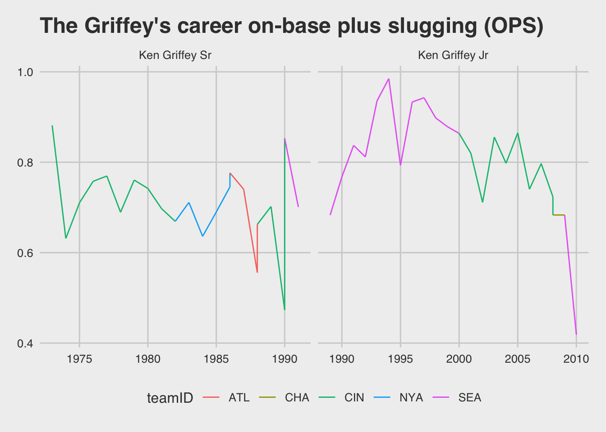

In the previous post I demonstrated how to install and use `MySQL` from
the command line. In this tutorial I will show you how to set up and
query a relational database management system (RDBMS) from RStudio.

The database
------------

These queries are done using the Lahman baseball data set available
[here](http://www.seanlahman.com/baseball-archive/statistics/).

I chose these data because 1) they are open to anyone and can be run on
your local machine, and 2) they are available as a .sql file and .csv
files for loading into any RDBMS software.

Database packages in RStudio
----------------------------

For this tutorial I will be using a local instance of `MySQL` with help
from the `DBI`, `dplyr`, and `RMySQL` packages.

``` r
library(DBI)
library(RMySQL)
library(RMariaDB)
library(dplyr)
library(rstudioapi)
library(ggthemes)
```

Change MySQL settings
---------------------

Before we can connect to a database with RStudio, we need to change a
few settings for MySQL in the **System Preferences**.

Select **MySQL** &gt;&gt; **Initialize Database**

Now enter a new password for the **root** user and select **Use Legacy
Password Encryption**. Then click **Start MySQL Sever**.

Connect to `MySQL` with `DBI::dbConnect()`
------------------------------------------

A `DBI` connection is built below to my local instance of `MySQL`.

``` r
LahmanDBIMySQL <- DBI::dbConnect(MySQL(), 
                    dbname = "lahman2016", 
                    host = "localhost", 
                    user = "root", 
                  # rstudioapi::askForPassword(prompt = "database password"))
                    password = "Med!c012")
LahmanDBIMySQL
```

    ## <MySQLConnection:0,0>

As I can see, this is a `<MySQLConnection:0,1>`. This is the object we
will use to access the `lahman2016` database.

Querying a database from RStudio
--------------------------------

We can get a list of tables in the `lahman2016` database by using the
`DBI::dbListTables()` function.

``` r
DBI::dbListTables(LahmanDBIMySQL)
```

    ##  [1] "AllstarFull"         "Appearances"         "AwardsManagers"     
    ##  [4] "AwardsPlayers"       "AwardsShareManagers" "AwardsSharePlayers" 
    ##  [7] "Batting"             "BattingPost"         "CollegePlaying"     
    ## [10] "Fielding"            "FieldingOF"          "FieldingOFsplit"    
    ## [13] "FieldingPost"        "Griffeys"            "HallOfFame"         
    ## [16] "HomeGames"           "Managers"            "ManagersHalf"       
    ## [19] "Master"              "Parks"               "Pitching"           
    ## [22] "PitchingPost"        "Salaries"            "Schools"            
    ## [25] "SeriesPost"          "Teams"               "TeamsFranchises"    
    ## [28] "TeamsHalf"

This is similar to the `SHOW TABLES;` command in `MySQL`. In the
previous tutorial, I built a table of statistics on Ken Griffey Junior
and Senior in the Lahman database. The `Griffeys` table contains
following fields.

``` r
DBI::dbListFields(LahmanDBIMySQL, "Griffeys") 
```

    ##  [1] "playerID"  "birthYear" "nameFirst" "nameLast"  "weight"   
    ##  [6] "height"    "bats"      "throws"    "retroID"   "bbrefID"  
    ## [11] "teamID"    "lgID"      "yearID"    "G"         "AB"       
    ## [16] "R"         "H"         "HR"        "RBI"       "BB"       
    ## [21] "SO"

Queries can be passed directly to the `DBI::dbGetQuery()` function, like
the `SELECT` statement below.

``` r
DBI::dbGetQuery(LahmanDBIMySQL, "SELECT * FROM Griffeys;") %>%
  dplyr::glimpse(78)
```

    ## Observations: 45
    ## Variables: 21
    ## $ playerID  <chr> "griffke01", "griffke01", "griffke01", "griffke01", "grif…
    ## $ birthYear <int> 1950, 1950, 1950, 1950, 1950, 1950, 1950, 1950, 1950, 195…
    ## $ nameFirst <chr> "Ken", "Ken", "Ken", "Ken", "Ken", "Ken", "Ken", "Ken", "…
    ## $ nameLast  <chr> "Griffey", "Griffey", "Griffey", "Griffey", "Griffey", "G…
    ## $ weight    <int> 190, 190, 190, 190, 190, 190, 190, 190, 190, 190, 190, 19…
    ## $ height    <int> 71, 71, 71, 71, 71, 71, 71, 71, 71, 71, 71, 71, 71, 71, 7…
    ## $ bats      <chr> "L", "L", "L", "L", "L", "L", "L", "L", "L", "L", "L", "L…
    ## $ throws    <chr> "L", "L", "L", "L", "L", "L", "L", "L", "L", "L", "L", "L…
    ## $ retroID   <chr> "grifk001", "grifk001", "grifk001", "grifk001", "grifk001…
    ## $ bbrefID   <chr> "griffke01", "griffke01", "griffke01", "griffke01", "grif…
    ## $ teamID    <chr> "CIN", "CIN", "CIN", "CIN", "CIN", "CIN", "CIN", "CIN", "…
    ## $ lgID      <chr> "NL", "NL", "NL", "NL", "NL", "NL", "NL", "NL", "NL", "AL…
    ## $ yearID    <int> 1973, 1974, 1975, 1976, 1977, 1978, 1979, 1980, 1981, 198…
    ## $ G         <int> 25, 88, 132, 148, 154, 158, 95, 146, 101, 127, 118, 120, …
    ## $ AB        <int> 86, 227, 463, 562, 585, 614, 380, 544, 396, 484, 458, 399…
    ## $ R         <int> 19, 24, 95, 111, 117, 90, 62, 89, 65, 70, 60, 44, 68, 33,…
    ## $ H         <int> 33, 57, 141, 189, 186, 177, 120, 160, 123, 134, 140, 109,…
    ## $ HR        <int> 3, 2, 4, 6, 12, 10, 8, 13, 2, 12, 11, 7, 10, 9, 12, 14, 2…
    ## $ RBI       <int> 14, 19, 46, 74, 57, 63, 32, 85, 34, 54, 46, 56, 69, 26, 3…
    ## $ BB        <int> 6, 27, 67, 62, 69, 54, 36, 62, 39, 39, 34, 29, 41, 15, 20…
    ## $ SO        <int> 10, 43, 67, 65, 84, 70, 39, 77, 42, 58, 45, 32, 51, 24, 4…

I realize I don’t have all the columns I want from the `Batting` and
`Fielding` tables, so I will query `lahman2016` again to collect these
data.

Aliasing columns in MySQL tables
--------------------------------

There are three columns in the `Batting` table I want to add to
`Griffeys`: `SF`, `2B`, and `3B`. Two of these names violate naming
rules in R.

``` r
DBI::dbListFields(LahmanDBIMySQL, "Batting") 
```

    ##  [1] "playerID" "yearID"   "stint"    "teamID"   "lgID"     "G"       
    ##  [7] "AB"       "R"        "H"        "2B"       "3B"       "HR"      
    ## [13] "RBI"      "SB"       "CS"       "BB"       "SO"       "IBB"     
    ## [19] "HBP"      "SH"       "SF"       "GIDP"

The `2B` and `3B` columns contain the number of doubles and triples for
each player, and `SF` is the number of sacrifice flies. Unfortunately, R
won’t allow columns to have names that start with a number. I can write
a query to inlcude these columns, but use an alias to create R-friendly
column names.

``` r
DBI::dbGetQuery(LahmanDBIMySQL, "SELECT 
  grf.playerID, 
  grf.birthYear, 
  grf.nameFirst, 
  grf.nameLast, 
  grf.weight, 
  grf.height, 
  grf.bats, 
  grf.throws, 
  grf.lgID,
  grf.yearID,
  grf.teamID,
  grf.G,
  grf.AB,
  grf.R,
  grf.H,
  grf.HR,
  grf.RBI,
  grf.BB,
  grf.SO,
  bat.2B AS dubs,
  bat.3B AS trips,
  bat.SF AS sac_flies
  FROM Griffeys AS grf
    INNER JOIN Batting AS bat
     ON grf.playerID = bat.playerID
     AND grf.yearID = bat.yearID
     AND grf.teamID = bat.teamID;") %>% glimpse(78)
```

    ## Observations: 45
    ## Variables: 22
    ## $ playerID  <chr> "griffke01", "griffke01", "griffke01", "griffke01", "grif…
    ## $ birthYear <int> 1950, 1950, 1950, 1950, 1950, 1950, 1950, 1950, 1950, 195…
    ## $ nameFirst <chr> "Ken", "Ken", "Ken", "Ken", "Ken", "Ken", "Ken", "Ken", "…
    ## $ nameLast  <chr> "Griffey", "Griffey", "Griffey", "Griffey", "Griffey", "G…
    ## $ weight    <int> 190, 190, 190, 190, 190, 190, 190, 190, 190, 190, 190, 19…
    ## $ height    <int> 71, 71, 71, 71, 71, 71, 71, 71, 71, 71, 71, 71, 71, 71, 7…
    ## $ bats      <chr> "L", "L", "L", "L", "L", "L", "L", "L", "L", "L", "L", "L…
    ## $ throws    <chr> "L", "L", "L", "L", "L", "L", "L", "L", "L", "L", "L", "L…
    ## $ lgID      <chr> "NL", "NL", "NL", "NL", "NL", "NL", "NL", "NL", "NL", "AL…
    ## $ yearID    <int> 1973, 1974, 1975, 1976, 1977, 1978, 1979, 1980, 1981, 198…
    ## $ teamID    <chr> "CIN", "CIN", "CIN", "CIN", "CIN", "CIN", "CIN", "CIN", "…
    ## $ G         <int> 25, 88, 132, 148, 154, 158, 95, 146, 101, 127, 118, 120, …
    ## $ AB        <int> 86, 227, 463, 562, 585, 614, 380, 544, 396, 484, 458, 399…
    ## $ R         <int> 19, 24, 95, 111, 117, 90, 62, 89, 65, 70, 60, 44, 68, 33,…
    ## $ H         <int> 33, 57, 141, 189, 186, 177, 120, 160, 123, 134, 140, 109,…
    ## $ HR        <int> 3, 2, 4, 6, 12, 10, 8, 13, 2, 12, 11, 7, 10, 9, 12, 14, 2…
    ## $ RBI       <int> 14, 19, 46, 74, 57, 63, 32, 85, 34, 54, 46, 56, 69, 26, 3…
    ## $ BB        <int> 6, 27, 67, 62, 69, 54, 36, 62, 39, 39, 34, 29, 41, 15, 20…
    ## $ SO        <int> 10, 43, 67, 65, 84, 70, 39, 77, 42, 58, 45, 32, 51, 24, 4…
    ## $ dubs      <int> 5, 9, 15, 28, 35, 33, 27, 28, 21, 23, 21, 20, 28, 7, 15, …
    ## $ trips     <int> 1, 5, 9, 9, 8, 8, 4, 10, 6, 2, 3, 1, 4, 0, 3, 1, 0, 0, 3,…
    ## $ sac_flies <chr> "0", "0", "3", "3", "2", "3", "3", "5", "4", "3", "2", "4…

Storing SQL in character vectors
--------------------------------

I can also assign the query above to a character vector
(`batting_query`) and pass the vector to the `DBI::dbGetQuery()`
function. I will assign these new variables to the `Griffeys` table.

``` r
batting_query <- "SELECT 
  grf.playerID, 
  grf.birthYear, 
  grf.nameFirst, 
  grf.nameLast, 
  grf.weight, 
  grf.height, 
  grf.bats, 
  grf.throws, 
  grf.lgID,
  grf.yearID,
  grf.teamID,
  grf.G,
  grf.AB,
  grf.R,
  grf.H,
  grf.HR,
  grf.RBI,
  grf.BB,
  grf.SO,
  bat.2B AS dubs,
  bat.3B AS trips,
  bat.SF AS sac_flies
  FROM Griffeys AS grf
    INNER JOIN Batting AS bat
     ON grf.playerID = bat.playerID
     AND grf.yearID = bat.yearID
     AND grf.teamID = bat.teamID;"
Griffeys <- DBI::dbGetQuery(LahmanDBIMySQL, batting_query) 
Griffeys %>% glimpse(78)
```

    ## Observations: 45
    ## Variables: 22
    ## $ playerID  <chr> "griffke01", "griffke01", "griffke01", "griffke01", "grif…
    ## $ birthYear <int> 1950, 1950, 1950, 1950, 1950, 1950, 1950, 1950, 1950, 195…
    ## $ nameFirst <chr> "Ken", "Ken", "Ken", "Ken", "Ken", "Ken", "Ken", "Ken", "…
    ## $ nameLast  <chr> "Griffey", "Griffey", "Griffey", "Griffey", "Griffey", "G…
    ## $ weight    <int> 190, 190, 190, 190, 190, 190, 190, 190, 190, 190, 190, 19…
    ## $ height    <int> 71, 71, 71, 71, 71, 71, 71, 71, 71, 71, 71, 71, 71, 71, 7…
    ## $ bats      <chr> "L", "L", "L", "L", "L", "L", "L", "L", "L", "L", "L", "L…
    ## $ throws    <chr> "L", "L", "L", "L", "L", "L", "L", "L", "L", "L", "L", "L…
    ## $ lgID      <chr> "NL", "NL", "NL", "NL", "NL", "NL", "NL", "NL", "NL", "AL…
    ## $ yearID    <int> 1973, 1974, 1975, 1976, 1977, 1978, 1979, 1980, 1981, 198…
    ## $ teamID    <chr> "CIN", "CIN", "CIN", "CIN", "CIN", "CIN", "CIN", "CIN", "…
    ## $ G         <int> 25, 88, 132, 148, 154, 158, 95, 146, 101, 127, 118, 120, …
    ## $ AB        <int> 86, 227, 463, 562, 585, 614, 380, 544, 396, 484, 458, 399…
    ## $ R         <int> 19, 24, 95, 111, 117, 90, 62, 89, 65, 70, 60, 44, 68, 33,…
    ## $ H         <int> 33, 57, 141, 189, 186, 177, 120, 160, 123, 134, 140, 109,…
    ## $ HR        <int> 3, 2, 4, 6, 12, 10, 8, 13, 2, 12, 11, 7, 10, 9, 12, 14, 2…
    ## $ RBI       <int> 14, 19, 46, 74, 57, 63, 32, 85, 34, 54, 46, 56, 69, 26, 3…
    ## $ BB        <int> 6, 27, 67, 62, 69, 54, 36, 62, 39, 39, 34, 29, 41, 15, 20…
    ## $ SO        <int> 10, 43, 67, 65, 84, 70, 39, 77, 42, 58, 45, 32, 51, 24, 4…
    ## $ dubs      <int> 5, 9, 15, 28, 35, 33, 27, 28, 21, 23, 21, 20, 28, 7, 15, …
    ## $ trips     <int> 1, 5, 9, 9, 8, 8, 4, 10, 6, 2, 3, 1, 4, 0, 3, 1, 0, 0, 3,…
    ## $ sac_flies <chr> "0", "0", "3", "3", "2", "3", "3", "5", "4", "3", "2", "4…

Now that we see the SQL works and these two tables are joined, we can
calculate a few new statistics in R.

Calculating On-base plus slugging (OPS)
---------------------------------------

A players [on-base plus slugging
(OPS)](https://en.wikipedia.org/wiki/On-base_plus_slugging) is a measure
of their overall batting performance. This is the sum of the player’s
on-base percentage and slugging average. The steps to calculate this
statsitic are below.

``` r
GriffsOPSbyYear <- Griffeys %>% 
  dplyr::mutate(
    # slugging percentage
    slug_perc = (H - dubs - trips - HR + 2 * dubs + 3 * trips + 4 * HR) / AB,
    # convert sac_flies to numeric
    sac_flies = as.numeric(sac_flies),
    # On Base Percentage
    ob_perc = (H + BB) / (H + AB + BB + sac_flies),
    # On-base plus slugging
    obslug_perc = slug_perc + ob_perc,
    # create a nameID
    nameID = 
      case_when(
        birthYear == 1950 ~ "Ken Griffey Sr",
        birthYear == 1969 ~ "Ken Griffey Jr"),
    # convert to a factor
    nameID = factor(nameID), 
    # make KGSr the reference
    nameID = relevel(nameID, ref = "Ken Griffey Sr"))
```

I created a few intermediate calculations before creating `obslug_perc`,
and I also created a `nameID` so the two players can be easily graphed.
Below is the on-base plus slugging (OPS) statistic for both Griffeys
over their career.

``` r
GriffsOPSbyYear %>% 
  ggplot2::ggplot(aes(x = yearID, y = obslug_perc, 
                      group = nameID, color = teamID)) +  
  geom_line() + 
  ggplot2::facet_grid(. ~ nameID, scales = "free") + 
  ggplot2::labs(
    title = "The Griffey's career on-base plus slugging (OPS)"
  ) + ggthemes::theme_fivethirtyeight()
```



The Lahman package in R
-----------------------

There is also a `Lahman` package in R. I will use this below to
demonstrate some of the similarities between `dplyr` and `MySQL` syntax.

Create an object for the `Lahman::Master`, `Lahman::Fielding`, and
`Lahman::Batting` tables.

``` r
Master <- Lahman::Master
Batting <- Lahman::Batting
Fielding <- Lahman::Fielding
```

The code below creates the same tables and graph using `dplyr` commands.

``` r
GriffeyOPSPlot <- Master %>% 
    dplyr::select(playerID, 
                  birthYear, 
                  nameLast) %>% 
  # find Griffeys
    dplyr::filter(nameLast %in% "Griffey") %>% 
  # join to batting table
    dplyr::inner_join(x = ., 
                      y = Batting, 
                      by = "playerID") %>% 
  # select/rename relevant columns
    dplyr::select(teamID,
                  nameLast,
                  playerID,
                  birthYear,
                  yearID,
                  G,
                  AB, 
                  R, 
                  H, 
                  HR, 
                  dubs = X2B, 
                  trips = X3B, 
                  RBI, 
                  BB, 
                  SO, 
                  sac_flies = SF) %>% 
    dplyr::mutate(
    # slugging percentage
    slug_perc = (H - dubs - trips - HR + 2 * dubs + 3 * trips + 4 * HR) / AB,
    # convert sac_flies to numeric
    sac_flies = as.numeric(sac_flies),
    # On Base Percentage
    ob_perc = (H + BB) / (H + AB + BB + sac_flies),
    # On-base plus slugging
    obslug_perc = slug_perc + ob_perc,
    # create a nameID
    nameID = 
      case_when(
        birthYear == 1950 ~ "Ken Griffey Sr",
        birthYear == 1969 ~ "Ken Griffey Jr"),
    # convert to a factor
    nameID = factor(nameID), 
    # make KGSr the reference
    nameID = relevel(nameID, ref = "Ken Griffey Sr")) %>% 
  # create plot of new OPS 
  ggplot2::ggplot(aes(x = yearID, y = obslug_perc, 
                      group = nameID, color = teamID)) +  
  geom_line() + 
  ggplot2::facet_grid(. ~ nameID, scales = "free") + 
  ggplot2::labs(
    title = "The Griffey's career on-base plus slugging (OPS)"
  ) + 
  ggthemes::theme_fivethirtyeight()
ggplot2::ggsave(filename = "GriffeyOPSPlot.png",  width = 7, height = 5, units = "in")
```

End
---
